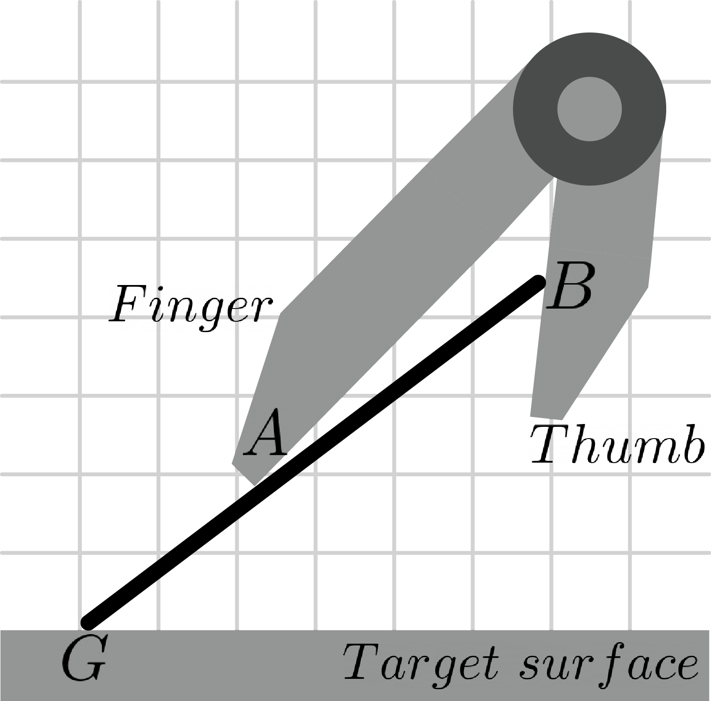

# Planning examples
Here, we present five planning examples generated by our planner to find the optimal solution for dexterous ungrasping. The scripts of running these examples are provided in this folder. The planning scenarios and the corresponding planning results with planner settings are shown as follows:

## Example 1: Failure with ordinary parallel-finger gripper
This example assumes an ordinary parallel-finger gripper with same fingers legnth is used. The planning scenario depicted as follows:

### 1.1 Result 
The planner was unable to return a complete path since the goal configuration lies outside force closure region. 

### 1.2 Planner settings
- ***start_point***: [40 0 0.5]
- ***goal_point***: [0 90 0.3]
- ***d_FT***: 0

## Example 2: Successful planning with digit asymmetry 
A asymmetric parallel-finger gripper with α = 0.47 is used in this example.

### 2.1 Result
The planner returns a complete path successfully from the initial to goal configurations with minimizing the changing of contact mode.

### 1.2 Planner settings
- ***start_point***: [30 0 0.8]
- ***goal_point***: [0 39 0.6]
- ***d_FT***: 0.47

## Example 3: Successful planning around another obstacle
An additional obstacle above the finger is added in this example with same griper setting as the previous example

### 3.1 Result
With the enlarged C_obs in the C-space, the planner can also find a solution without travsing within the C_obs.

### 3.2 Planner settings
- ***start_point***: [30 0 0.8]
- ***goal_point***: [0 39 0.6]
- ***d_FT***: 0.47
- ***corner_x***: 0.3
- ***corner_y***: 0.7

## Example 4: Successful planning with rounded fingertip
A gripper with rounded fingertip (non-zero radius of curvature at **A**) is used in this example.

### 4.1 Result

## Example 5: Successful planning with pincer-like two-fingered gripper
A pincer-like two-fingered gripper where the fingers are connected through a revolute joint is used in this example.

### 5.1 Result

