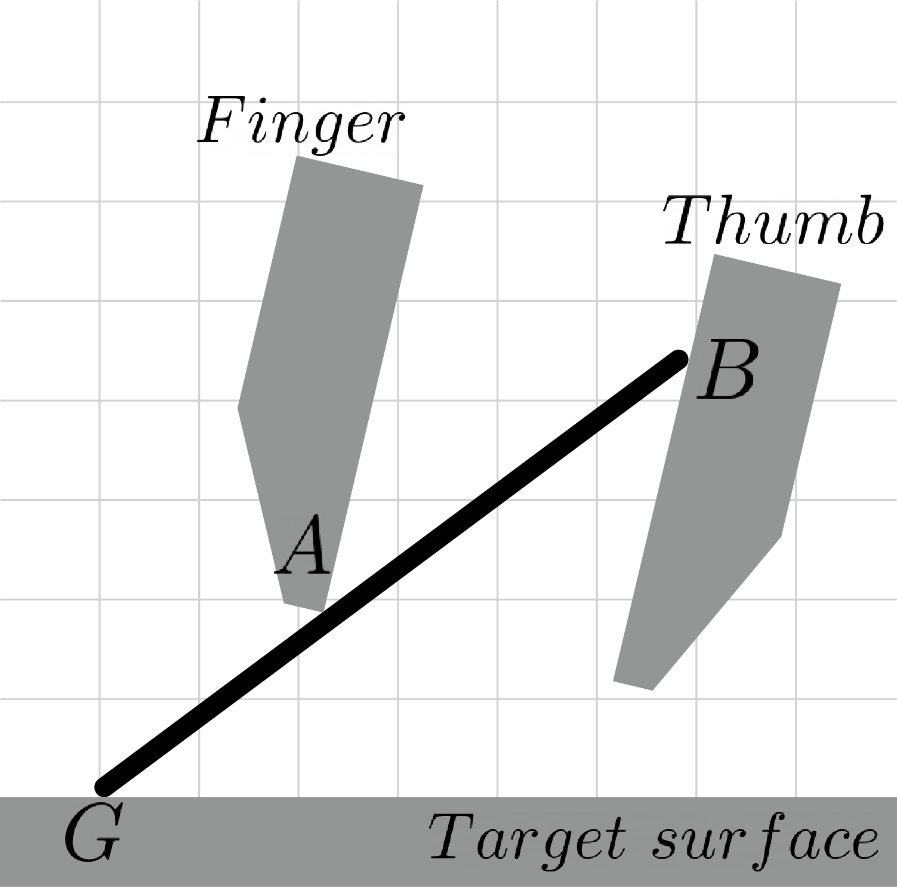
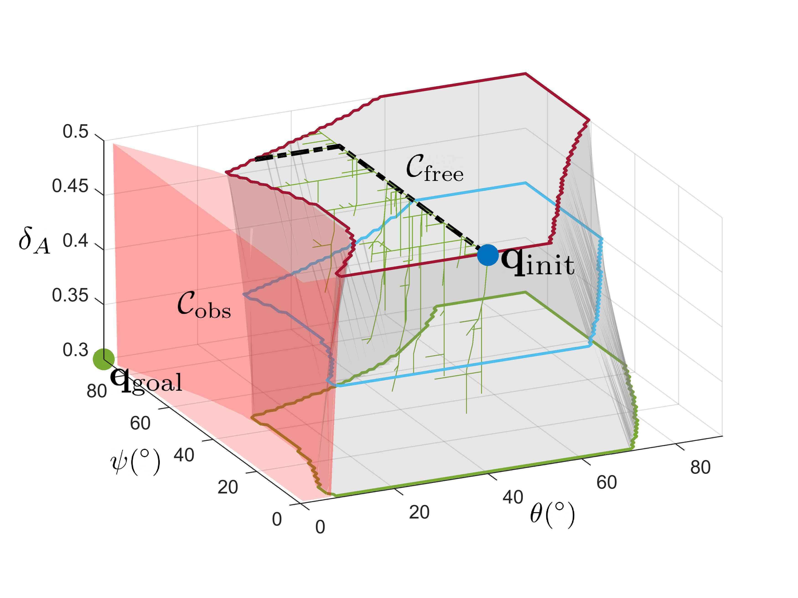
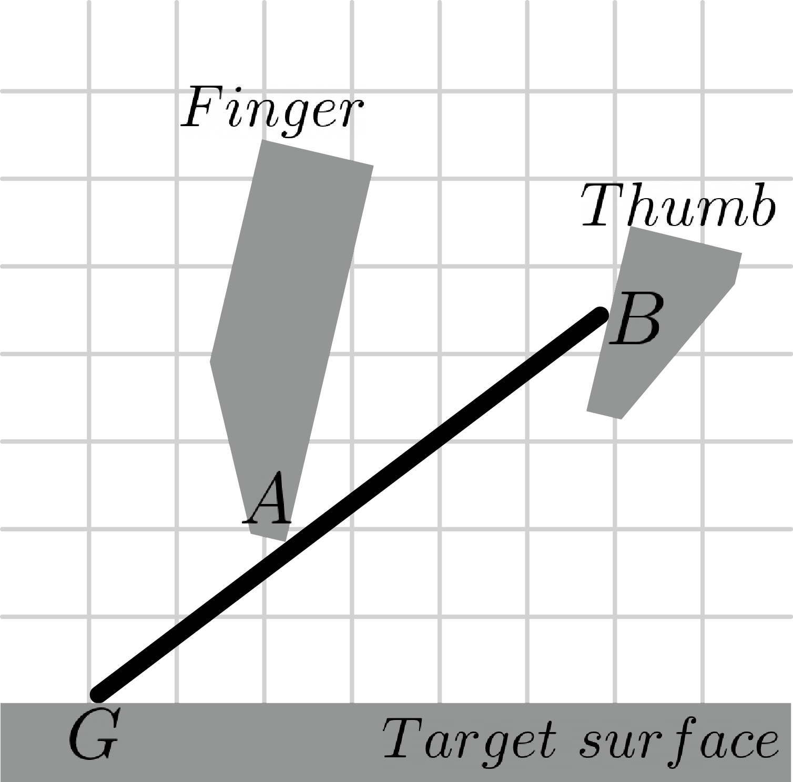
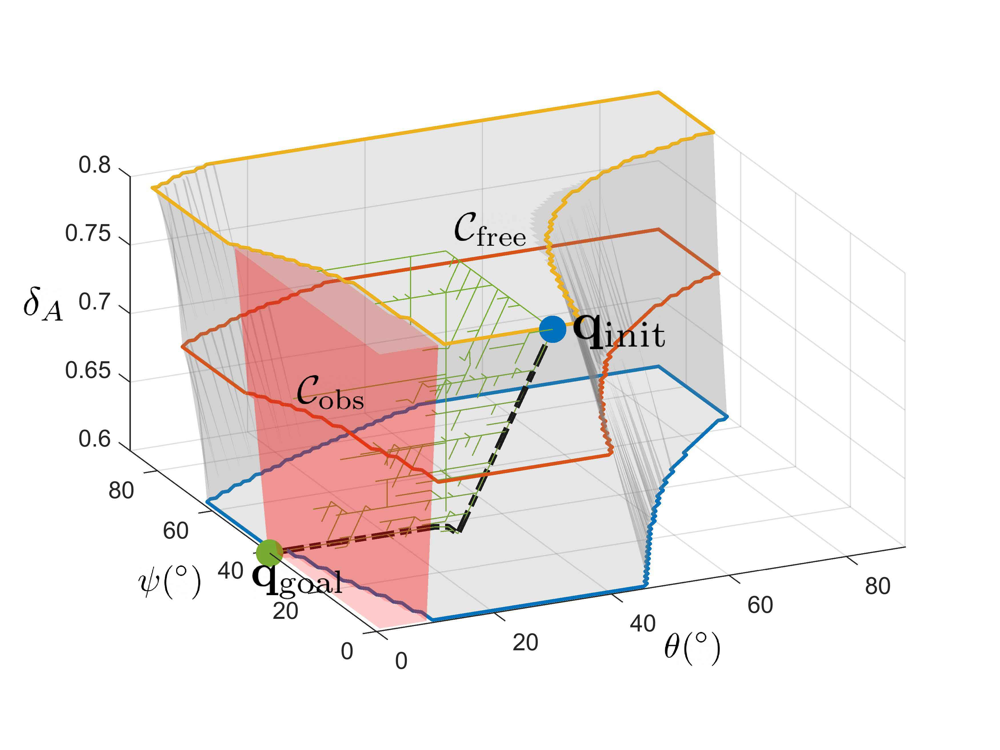
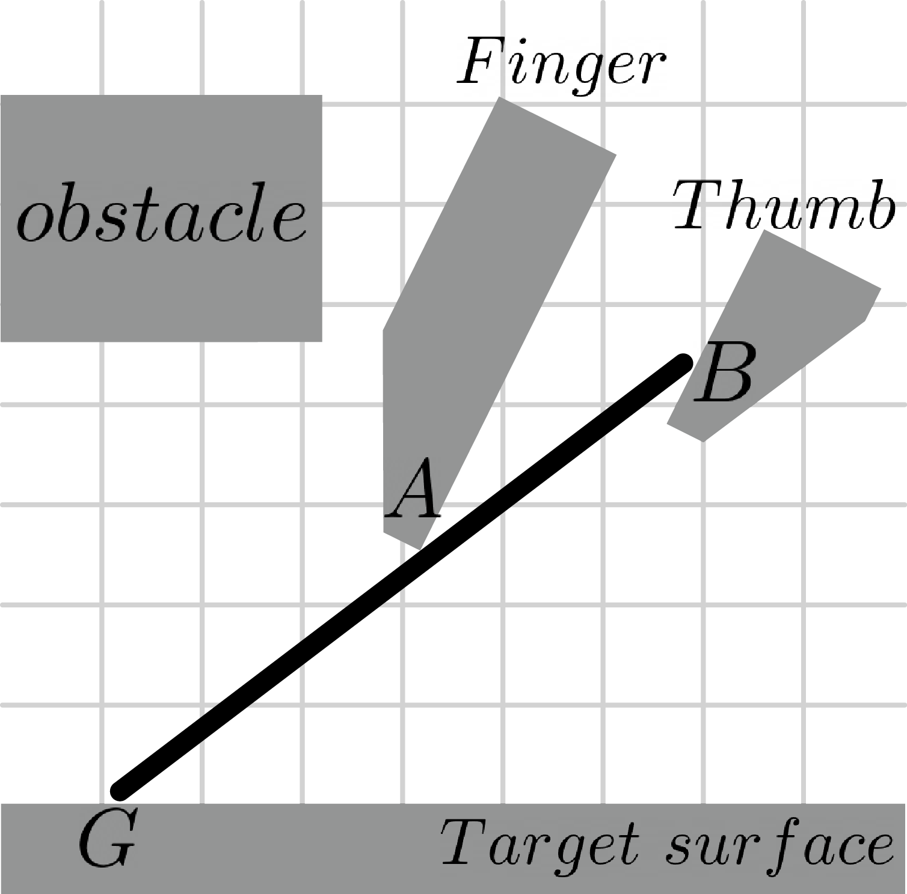
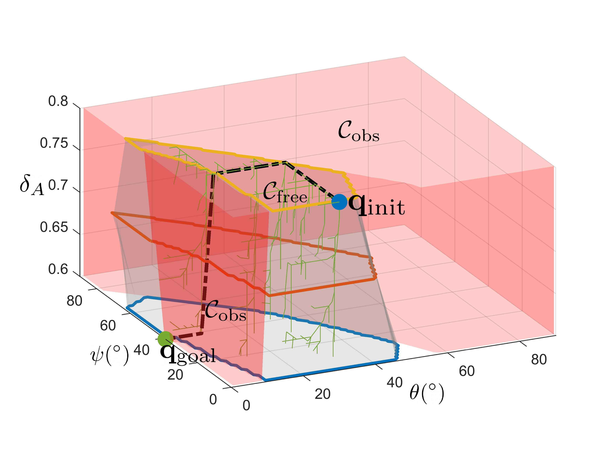
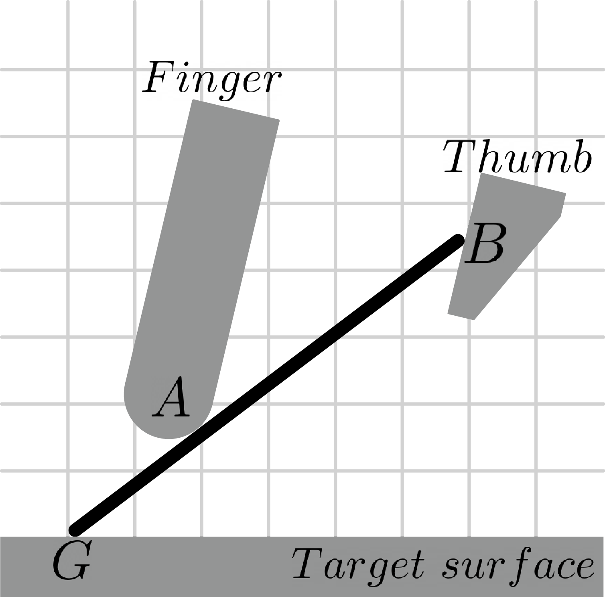
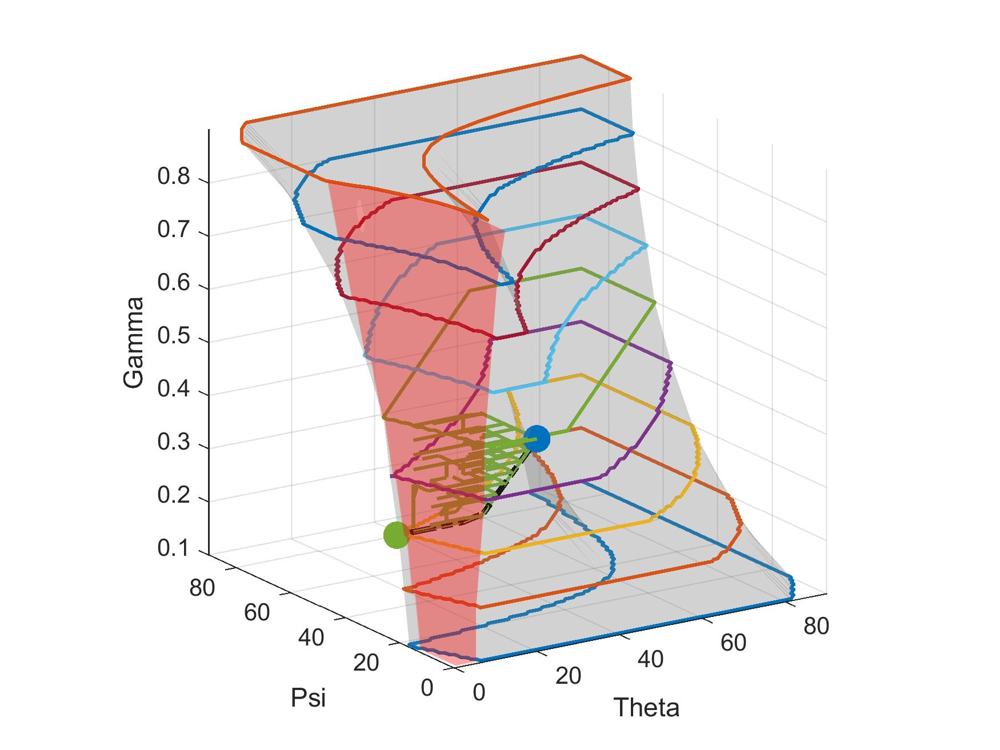
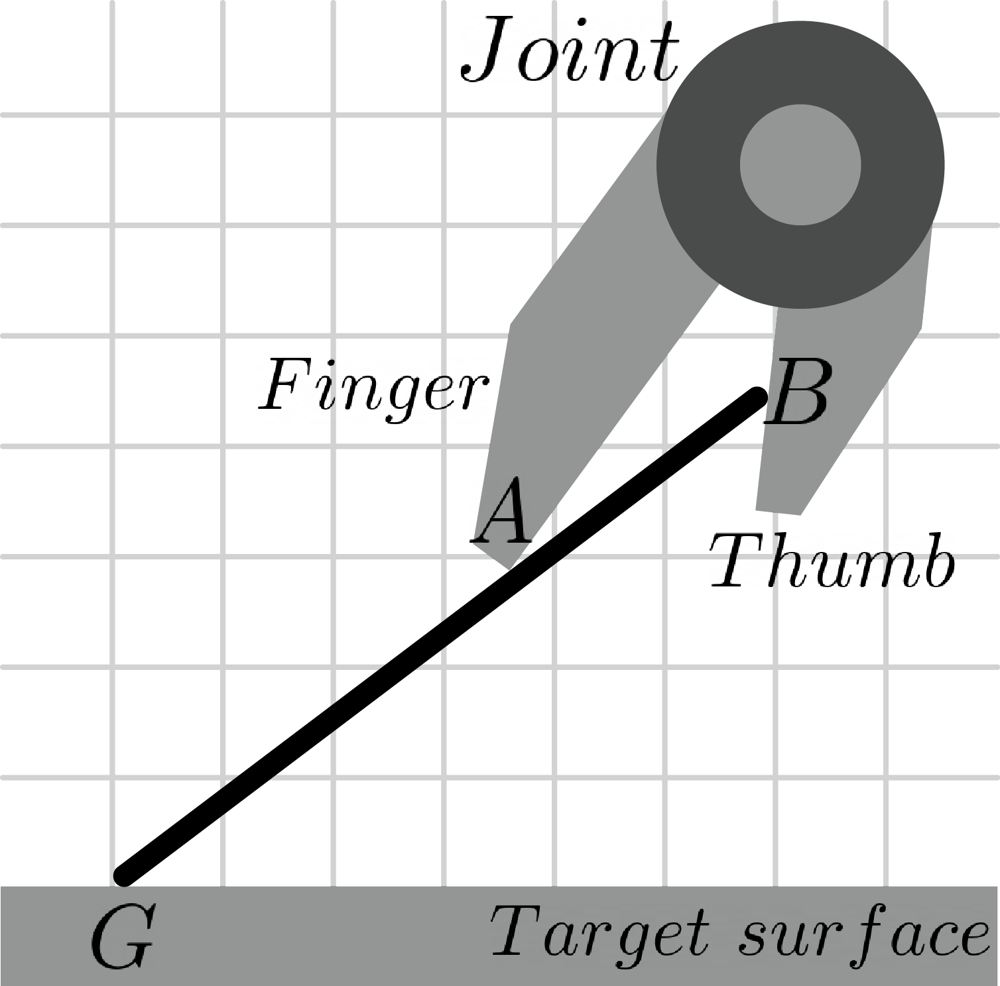
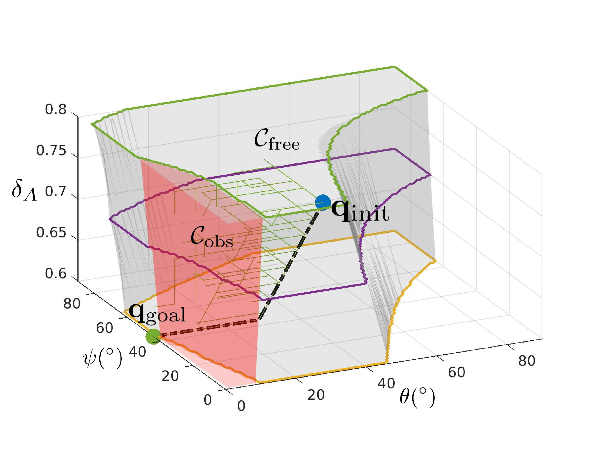

# Planning examples
Here, we present the examples of planning solution generated by our planner for dexterous ungrasping. The scripts of running these examples are provided in this folder. The planning scenarios and the corresponding results and settings are shown as follows:

## Example 1: Failure with ordinary parallel-finger gripper
This example assumes an ordinary parallel-finger gripper with same fingers legnth is used. The planning scenario is depicted as follows:

### 1.1 Result 
The planner was unable to return a complete path since the goal configuration lies outside force closure region. 

### 1.2 Settings
- ***start_point***: [40 0 0.5]
- ***goal_point***: [0 90 0.3]
- ***finger_length***: 0.75
- ***d_FT***: 0

## Example 2: Successful planning with digit asymmetry 
Now, an asymmetric parallel-finger gripper with **α = 0.47** is used in this example.

### 2.1 Result
The planner returns a complete path successfully from the initial to goal configurations with minimizing the changing of contact mode.

### 2.2 Settings
- ***start_point***: [30 0 0.8]
- ***goal_point***: [0 39 0.6]
- ***finger_length***: 0.75
- ***d_FT***: 0.47

## Example 3: Successful planning around another obstacle
An additional obstacle above the finger is added in this example with the same gripper setting as the previous example.

### 3.1 Result
With the enlarged **C_obs** in the C-space, the planner can also find a solution without travsing within the region of **C_obs**.

### 3.2 Settings
- ***start_point***: [30 0 0.8]
- ***goal_point***: [0 39 0.6]
- ***finger_length***: 0.75
- ***d_FT***: 0.47
- ***corner_x***: 0.3
- ***corner_y***: 0.7

## Example 4: Successful planning with a roller at fingertip
In this example, we replaced the point contact at **A** with round fingertip to make it roll without sliding as **ψ** increases. **δ_A** will increase since the round fingertip will roll towards **G**.

### 4.1 Result
The planner found a solution with first increase **ψ** and **δ_A** simuatanely, then decrease **δ_A** and **θ** monotonically to reach the goal.

### 4.2 Settings
- ***start_point***: [30 0 0.6]
- ***goal_point***: [0 39 0.6]
- ***finger_length***: 0.75
- ***d_FT***: 0.47
- ***tip_radius***: 0.6 (radius of curvature at **A**)

## Example 5: Successful planning with pincer-like two-fingered gripper
We have also devised another planning example of using a 1 DOF gripper with different mechanism to perform a placement task. Below shows a pincer-like two-fingered gripper where the fingers are connected through a revolute joint.

### 5.1 Result
Although a variant form of gripper is used in this example, an ungrasping solution still can be generated successfully by our planner since the C-space is representated by **[θ, ψ, δ_A]**, which is independent to how the gripper is actuated as long as the C-space parameters exist in the system.

### 5.2 Settings
- ***start_point***: [30 5 0.8]
- ***goal_point***: [0 44 0.6]
- ***finger_length***: 0.75
- ***d_FT***: 0.4
- ***finger_radius*** = 1 (distance between the fingertip to revolute joint of the gripper)